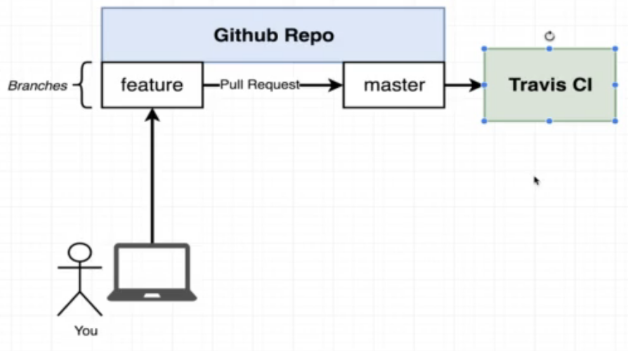

0.simple-web: Simple node.js based backend dockerized:

-  docker build -t yourName/simpleweb .
-  docker run -p 8080:8080 yourNameAccount/simpleweb

1.visits-counter:

- docker-compose up

2.production-grade-workflow

