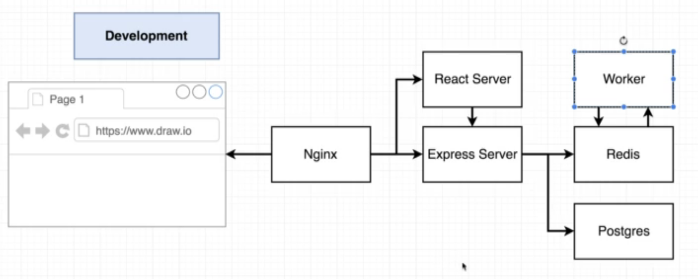
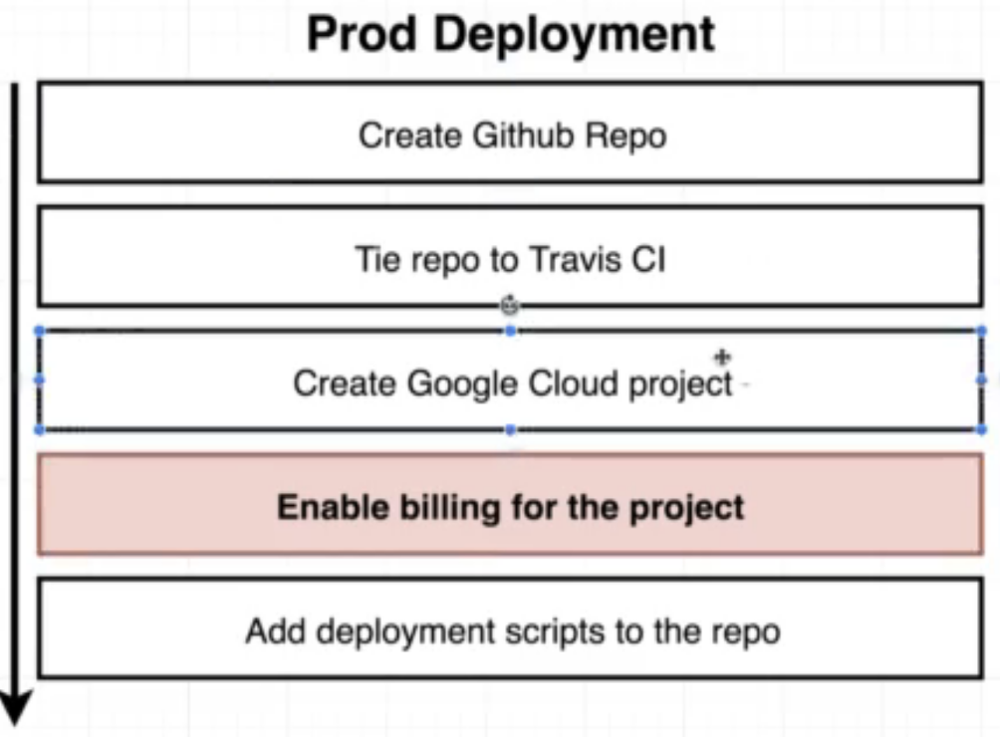

## 0.simple-web: 

-  docker build -t yourName/simpleweb .
-  docker run -p 8080:8080 yourNameAccount/simpleweb

## 1.visits-counter:

- docker-compose up

## 2.production-grade-workflow


## 3.fibonacci-sequence




### 4. K8S deployment of Project 3 

To run you need to add the secrets in an imperative way (commands typing from terminal):

```kubectl create secret generic pgpassword --from-literal POSTGRES_PASSWORD=password ```

Install ingress-nginx on your kubernetes cluster: https://kubernetes.github.io/ingress-nginx/deploy/#quick-start


### 5. K8S deployment on Google Cloud (prod ready) of Project 3

1. Make sure to setting up Workload Identity Federation: https://github.com/google-github-actions/auth#setting-up-workload-identity-federation

2. Refer to the file in workflows/5.deployment-on-google-cloud.yaml

3. Now the following secret command has to be launched on the google console from your google cloud account.

   ```kubectl create secret generic pgpassword --from-literal POSTGRES_PASSWORD=password ```

4. At this point you need from the google cloud console install Helm: https://helm.sh/docs/intro/install/#from-script

5. After you can install from the google cloud console Ingress-Nginx:

   ```
   helm repo add ingress-nginx https://kubernetes.github.io/ingress-nginxhelm install my-release ingress-nginx/ingress-nginx
   ```

