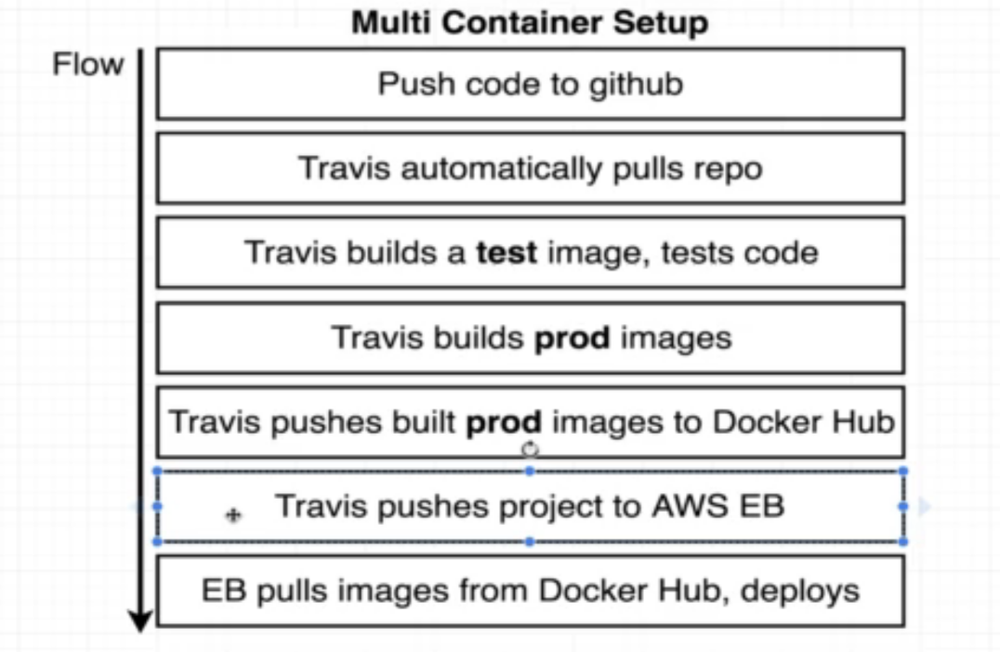

## 0.simple-web: 

-  docker build -t yourName/simpleweb .
-  docker run -p 8080:8080 yourNameAccount/simpleweb

## 1.visits-counter:

- docker-compose up

## 2.production-grade-workflow

## 3.fibonacci-sequence

