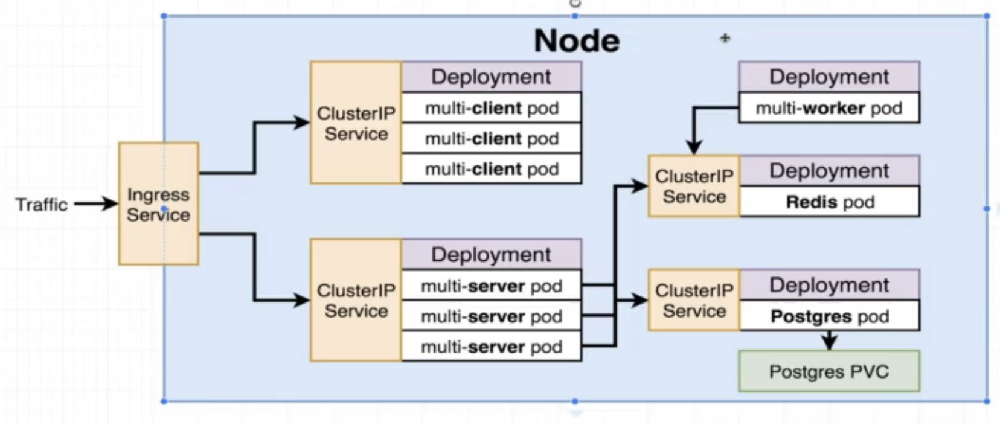

## 0.simple-web: 

-  docker build -t yourName/simpleweb .
-  docker run -p 8080:8080 yourNameAccount/simpleweb

## 1.visits-counter:

- docker-compose up

## 2.production-grade-workflow


## 3.fibonacci-sequence


### 4. K8S deployment of Project 3 

To run you need to add the secrets in an imperative way (commands typing from terminal):

```kubectl create secret generic pgpassword --from-literal POSTGRES_PASSWORD=password ```

